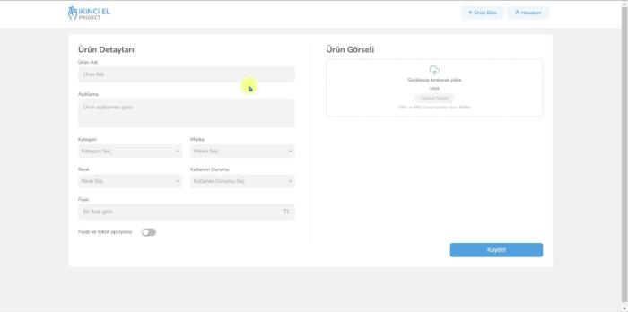
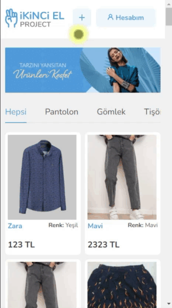
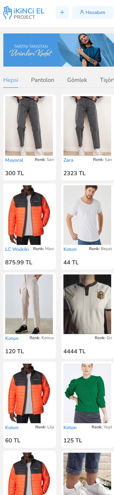
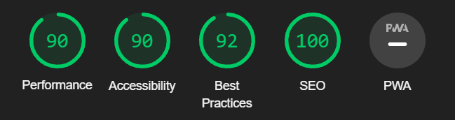

## İkinci El Project (Second Hand Project)

The place where users sell the products they use. Users who see this can bid and buy.

<!-- prettier-ignore -->
| TECHNOLOGY | STYLE | LINTERS | DEPLOY | DESIGN | BACKEND |
|--|--|--|--|--|--|
| | | | ||

## [Click to try the project in the online version](https://ikinci-el-project.netlify.app/)

<!-- prettier-ignore -->
If you want to try the project in your local, follow the steps below

1. Clone the repository to your local.
2. Run `yarn` command
3. If there are corruptions in the code, run the following command

```
yarn lint:fix
```

4. Create a .env file in the area where the package.json file is located. Paste the text below into it.

```
REACT_APP_API_BASE_URL=https://bootcamp.akbolat.net
```

5. Start the project with the `yarn start` command.`

---

<!-- prettier-ignore -->
| Desktop | Mobile |
|-----------------------|--------------------|
|  |  |

<!-- prettier-ignore -->
| Desktop | Mobile |
|-----------------------|--------------------|
|  |  |

<!-- prettier-ignore -->
| Desktop | Mobile |
|-----------------------|--------------------|
|  |  |


